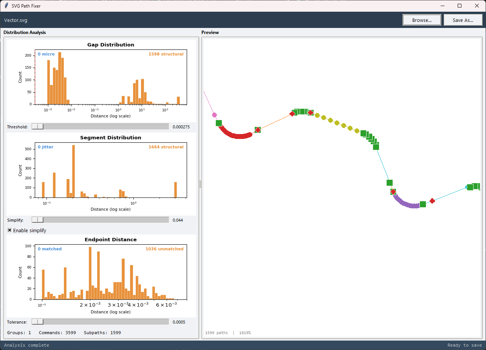
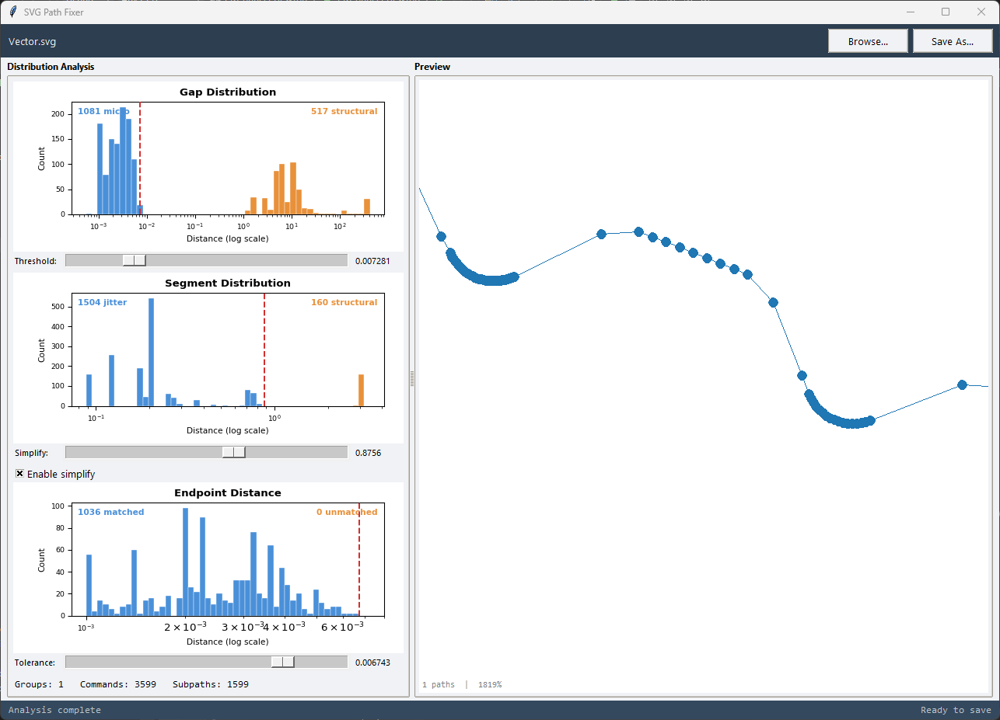
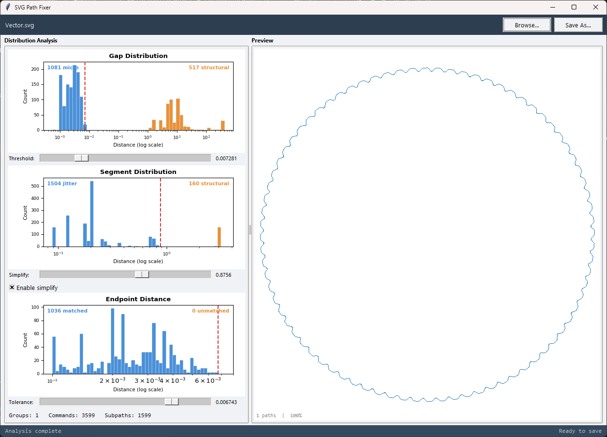

# svgpathfix

Joins fragmented SVG subpaths into continuous paths.

CAD tools, vector editors, and PDF-to-SVG converters often export SVG `<path>` elements as hundreds of disconnected subpaths — each starting with an `M` (moveTo) command — even though they should be one continuous stroke. This breaks fill rules, makes editing difficult, bloats file size, and causes rendering artifacts.

**svgpathfix** analyzes the geometry, recommends optimal parameters, and repairs the paths automatically.

| Before (1599 fragmented paths) | After (1 continuous path) |
|:---:|:---:|
|  |  |

## Features

- **5-step repair pipeline** — threshold join, graph trace, endpoint dedup, segment simplify, subpath close
- **Smart auto-analysis** — recommends parameters by finding natural clusters in your SVG's distance distributions
- **Interactive GUI** with real-time preview that updates as you drag sliders
- **Three distribution histograms** (gaps, segments, endpoints) on log-scale with adjustable thresholds
- **Zoom/pan preview** with color-coded subpaths and start/end markers
- **Drag-and-drop** SVG loading (with `tkinterdnd2`)
- **CLI** for batch or scripted use
- Runs fully offline — no external services



## Installation

**Python 3.8+** required.

```bash
# Clone the repo
git clone https://github.com/valentino-saitz-optris/svgpathfix.git
cd svgpathfix

# Install optional dependencies (recommended)
pip install -r requirements.txt
```

| Dependency | Required | Purpose |
|---|---|---|
| Python 3.8+ | Yes | Core runtime |
| tkinter | Yes | GUI (included with most Python installs) |
| matplotlib + numpy | No | Interactive histogram charts in the GUI |
| tkinterdnd2 | No | Drag-and-drop file loading |

Without `matplotlib`, the GUI falls back to a text-based analysis panel. Without `tkinterdnd2`, you can still open files via the Browse button or command line.

## Usage

### GUI

```bash
# Launch with welcome screen
python svgpathfix.py

# Open a file directly
python svgpathfix.py drawing.svg
```

**Workflow:**

1. **Load** — drop an SVG onto the window, click "Browse", or pass it as an argument
2. **Analyze** — the tool scans all path geometry and recommends threshold, simplify, and tolerance values
3. **Adjust** — drag the sliders to fine-tune; the preview updates in real time
4. **Save** — click "Save As" to write the fixed SVG

**Preview controls:**

| Action | Control |
|---|---|
| Zoom | Mouse wheel |
| Pan | Click and drag |
| Reset view | Double-click |

At high zoom levels, individual path vertices become visible along with start (green square) and end (red diamond) markers for open subpaths.

### CLI

```bash
python svgpathfix_cli.py <input.svg> [output.svg] [threshold] [--simplify N] [--tolerance N]
```

| Argument | Default | Description |
|---|---|---|
| `input.svg` | *(required)* | Input SVG file |
| `output.svg` | `<input>_fixed.svg` | Output SVG file |
| `threshold` | `0.5` | Max gap distance to auto-join (step 1) |
| `--simplify N` | off | Collapse line segments shorter than N (step 4) |
| `--tolerance N` | `0.1` | Max endpoint distance to merge in graph trace (step 2) |

**Examples:**

```bash
# Basic usage — output goes to drawing_fixed.svg
python svgpathfix_cli.py drawing.svg

# Custom output and threshold
python svgpathfix_cli.py drawing.svg fixed.svg 0.3

# With segment simplification
python svgpathfix_cli.py drawing.svg fixed.svg 0.5 --simplify 0.2

# With custom graph-trace tolerance
python svgpathfix_cli.py drawing.svg fixed.svg 0.5 --tolerance 0.5
```

## How It Works

The repair pipeline runs 5 steps in sequence:

### 1. Join by threshold

Scans for `M` (moveTo) commands where the gap from the current pen position is smaller than the threshold. Replaces them with `L` (lineTo), connecting the subpaths.

### 2. Graph trace

Treats each remaining subpath as an edge in an undirected graph, with its start and end points as vertices. Uses union-find to merge nearby vertices (within the tolerance), then traces continuous paths through the graph — reversing subpaths where needed to maintain direction.

### 3. Deduplicate endpoints

Removes near-zero-length line segments caused by coordinate rounding artifacts. When a tiny segment is found, its endpoint replaces the previous command's endpoint and the segment is dropped.

### 4. Simplify short runs (optional)

Finds consecutive runs of short line segments (length <= the simplify threshold) and replaces each run with a single straight line from start to end. This cleans up jittery micro-segments from low-resolution vectorization.

### 5. Close subpaths

If a subpath's endpoint is within tolerance of its start point, snaps the start to match and appends a `Z` command to formally close it.

## Parameters

The GUI auto-analyzes your SVG and recommends values. Here's what each parameter controls:

| Parameter | Pipeline step | What it does |
|---|---|---|
| **Threshold** | Step 1 (join) | Max gap distance to bridge with a line. Higher = more aggressive joining. |
| **Simplify** | Step 4 (simplify) | Max segment length to consider "jitter". Segments shorter than this get collapsed. Can be disabled. |
| **Tolerance** | Step 2 (graph trace) | Max distance between endpoints to consider them the same vertex. Controls how aggressively subpaths get merged in the graph. |

The auto-analysis finds these values by looking for natural gaps in the distance distributions — the boundary between "noise" (micro-gaps, jitter segments) and "structural" distances.

## Files

| File | Description |
|---|---|
| `svgpathfix.py` | Tkinter GUI — auto-analysis, interactive charts, real-time preview |
| `svgpathfix_cli.py` | Core engine — SVG parser, 5-step pipeline, CLI interface |

## License

MIT License. See [LICENSE](LICENSE).
